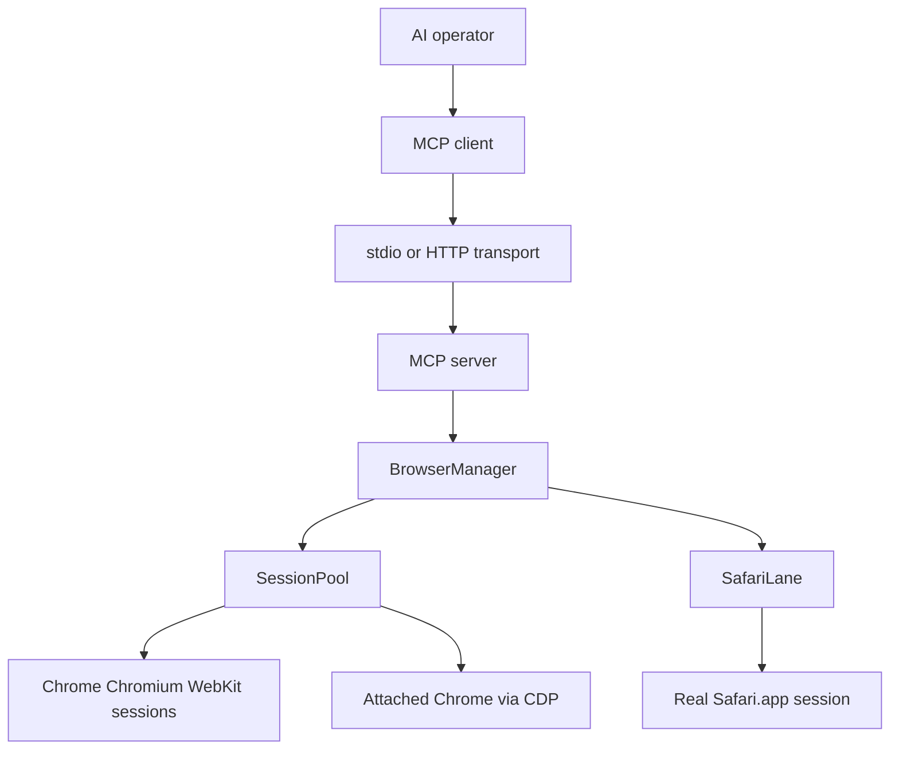
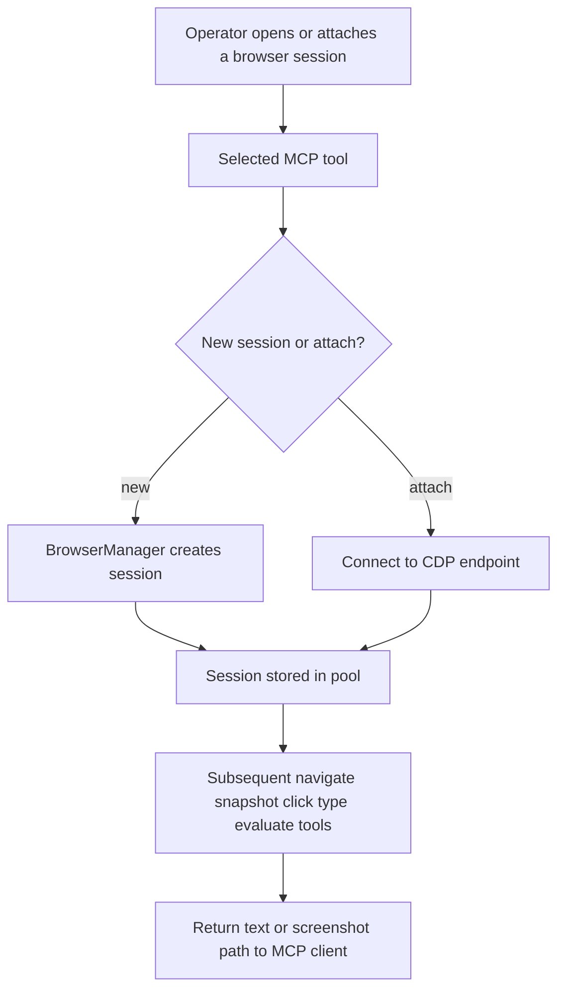

# apex-browser-mcp

Local multi-session browser MCP for real Chrome, Chromium, WebKit, and real Safari, plus attach to
an already-running Chrome session without moving the work into a cloud browser.

Release posture: npm package `@apexradius/browser-mcp`, version `1.0.0` from
[`package.json`](package.json).

## Choose your path

| You are... | Start here | Then |
|---|---|---|
| Running the daemon or stdio server | [docs/start-here.md](docs/start-here.md) | Quick start below |
| Auditing browser routing or attach behavior | [docs/architecture.md](docs/architecture.md) | [`src/manager.js`](src/manager.js) |
| Reviewing the MCP tool surface | [`src/server.js`](src/server.js) | [`src/index.js`](src/index.js) |

## Architecture



## Request flow



## Quick start

1. Install dependencies and browser engines.

```bash
npm install
npx playwright install chromium webkit
```

2. Start the shared HTTP daemon.

```bash
APEX_BROWSER_TRANSPORT=http node src/index.js
```

3. Register it in your MCP client.

```json
{
  "mcpServers": {
    "apex-browser": {
      "type": "http",
      "url": "http://127.0.0.1:3010/mcp"
    }
  }
}
```

## Available tools

| Tool group | Tools | Purpose |
|---|---|---|
| Session lifecycle | `browser_new_session`, `browser_attach`, `browser_list_sessions`, `browser_close_session` | Open, adopt, inspect, and close sessions |
| Navigation and state | `browser_navigate`, `browser_snapshot` | Load pages and capture indexed interactive refs |
| Interaction | `browser_click`, `browser_type`, `browser_evaluate` | Drive page interactions and execute page JS |
| Artifacts | `browser_screenshot` | Save a PNG and return its path |

## Runtime proof

| Claim | Proof |
|---|---|
| Package entry point is stable | `"apex-browser-mcp": "src/index.js"` in [`package.json`](package.json) |
| HTTP and stdio transports are both first-class | Transport selection in [`src/index.js`](src/index.js) |
| Session routing is engine-aware | `BrowserManager` in [`src/manager.js`](src/manager.js) |
| Tool registration is centralized | `buildServer()` in [`src/server.js`](src/server.js) |

## Repo map

| Path | Purpose |
|---|---|
| [`src/index.js`](src/index.js) | Process entry point, transport selection, HTTP daemon |
| [`src/server.js`](src/server.js) | MCP tool registration and request handlers |
| [`src/manager.js`](src/manager.js) | Unified routing across SessionPool and SafariLane |
| [`src/pool.js`](src/pool.js) | Multi-session Playwright and CDP attach backend |
| [`src/safari.js`](src/safari.js) | Real Safari.app lane |
| [`docs/start-here.md`](docs/start-here.md) | Setup, env, validation, common failures |
| [`docs/architecture.md`](docs/architecture.md) | Component map and runtime lifecycle |

## Validation

| Check | Command |
|---|---|
| Core regression suite | `npm test` |
| Attached-Chrome concurrency | `node test/attach-concurrent.js` |
| README/docs links stay local | `rg '\\]\\(([^)]+\\.md)\\)' README.md docs/` |

## License

MIT
