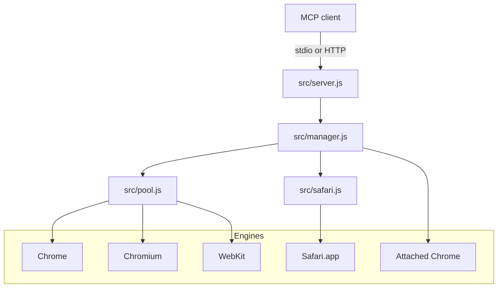
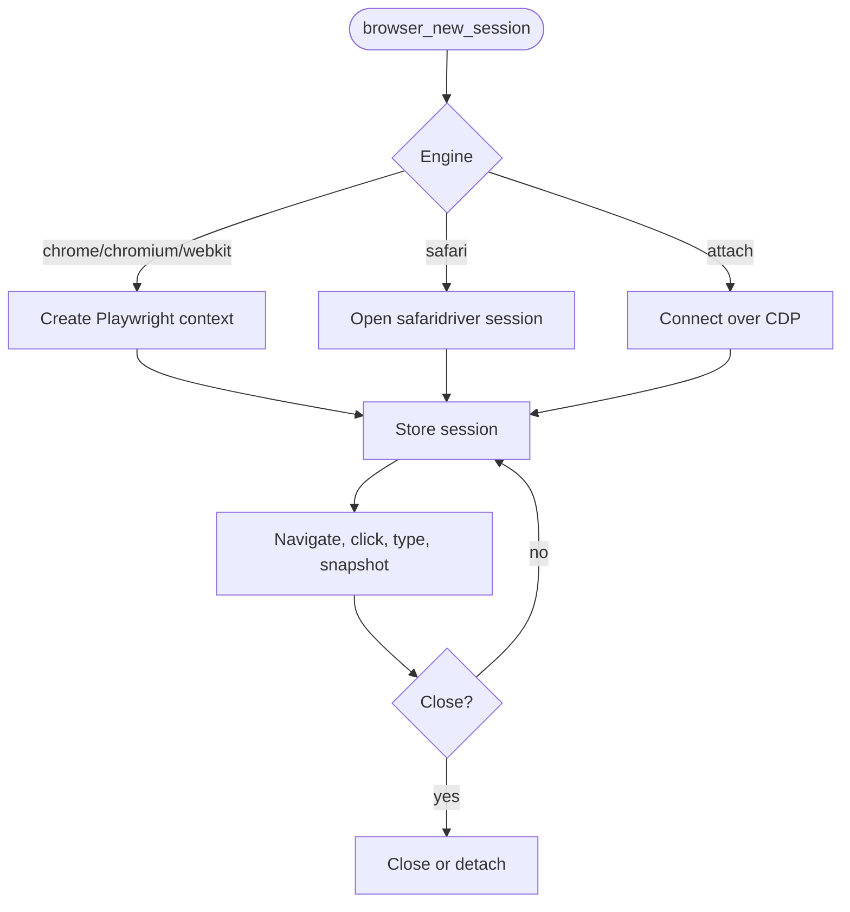

# apex-browser-mcp

Own, local, multi-session browser MCP. One tool surface drives **real Chrome**, **Chromium**, **WebKit (Safari engine)**, and **real Safari.app** — plus **attach to an already-running Chrome** and drive many isolated sessions on it concurrently. No API keys, no cloud, runs on your machine.

Built because leapfrog / browser-use are Chromium-only (and browser-use needs a per-step LLM key). This spans engines and keeps everything local.

## Start Here

| You are | Start with | Time |
|---|---|---:|
| Installing locally | [Run](#run) | 10 min |
| Connecting an MCP client | [Register in an MCP client](#register-in-an-mcp-client) | 5 min |
| Extending browser behavior | [docs/architecture.md](docs/architecture.md) and `src/manager.js` | 15 min |

## Architecture



See [docs/architecture.md](docs/architecture.md) for sequence diagrams and engine boundaries.

## Primary Workflow



## Engines

| `engine` | Backend | Sessions | Use |
|---|---|---|---|
| `chrome` | Playwright chromium, `channel=chrome` | N | real Chrome |
| `chromium` | Playwright chromium (bundled) | N | headless/CI |
| `webkit` | Playwright webkit | N | Safari-engine cross-browser testing |
| `safari` | safaridriver (WebDriver) | **1** (OS limit) | real Safari.app |
| *(attach)* | CDP `connectOverCDP` | N | drive your already-running logged-in Chrome |

## Tools

`browser_new_session` · `browser_attach` · `browser_navigate` · `browser_snapshot` (indexed refs `e1,e2…`) · `browser_click` · `browser_type` · `browser_evaluate` · `browser_screenshot` · `browser_list_sessions` · `browser_close_session`

## Run

**As a daemon (multi-client, non-blocking — recommended):**
```bash
npm install && npx playwright install chromium webkit
APEX_BROWSER_TRANSPORT=http node src/index.js   # http://127.0.0.1:3010/mcp
```
On macOS a LaunchAgent (`com.apex.browser-mcp`) keeps it running across reboots.

**As stdio (single client):** `node src/index.js`

### Register in an MCP client
```json
{ "mcpServers": { "apex-browser": { "type": "http", "url": "http://127.0.0.1:3010/mcp" } } }
```

### Env
`APEX_BROWSER_TRANSPORT` (stdio|http) · `APEX_BROWSER_PORT` (3010) · `APEX_BROWSER_MAX_SESSIONS` (15) · `APEX_BROWSER_HEADLESS` (1=headless) · `APEX_BROWSER_SHOTS` (/tmp)

**Auto-attach** (opt-in): `APEX_BROWSER_AUTOATTACH=1` makes the daemon poll `APEX_BROWSER_CDP` (default `http://127.0.0.1:9222`) and adopt a session the moment a debug Chrome appears — surviving boot-ordering and self-healing if that Chrome closes/reopens. Tune with `APEX_BROWSER_AUTOATTACH_MODE` (default|isolated) and `APEX_BROWSER_AUTOATTACH_INTERVAL` (ms, 5000).

## Attach to your real Chrome
```bash
bin/chrome-debug.sh real   # quit Chrome first; relaunches your profile with a debug port
# then: browser_attach { mode: "default" }   → your logged-in session
#       browser_attach { mode: "isolated" }  → fresh stealthed context on the same Chrome
```
`bin/chrome-debug.sh` (no arg) uses a safe dedicated automation profile instead.

**Safety invariant:** attached browsers are never closed by us — sessions detach, your Chrome keeps running.

## Test
```bash
node test/extensive.js        # 29 checks: engines, concurrency, isolation, errors, interaction, daemon
node test/attach-concurrent.js  # 5 sessions driving ONE attached Chrome simultaneously
```

## Ops
- restart: `launchctl kickstart -k gui/$(id -u)/com.apex.browser-mcp`
- health: `curl localhost:3010/health` · logs: `/tmp/abm-daemon.log`

## Notes
- Real Safari.app is single-session (Apple `safaridriver` limit) and runs an automation window that does **not** inherit your everyday Safari logins. For real logins use `chrome` + `browser_attach`.
- Node resolved via the mise shim so a version bump won't break the daemon.

MIT © Apex Radius

## Reference

- [Start here](docs/start-here.md)
- [Architecture](docs/architecture.md)
