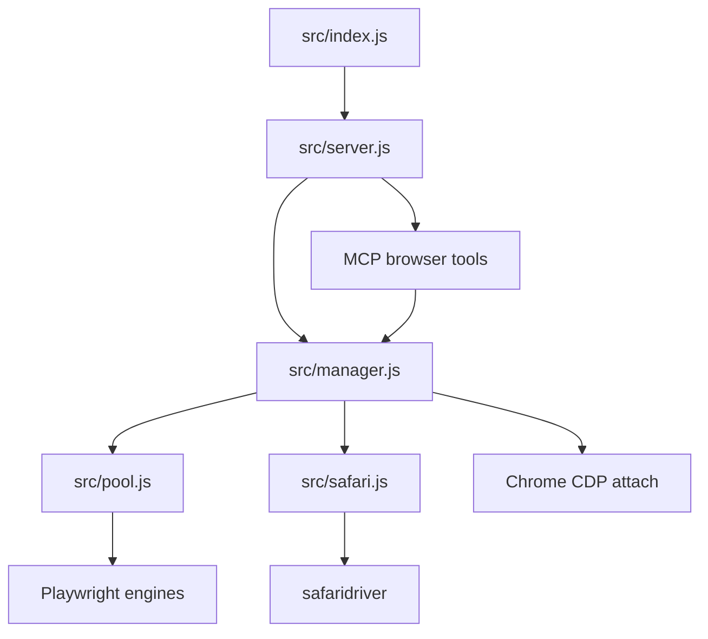
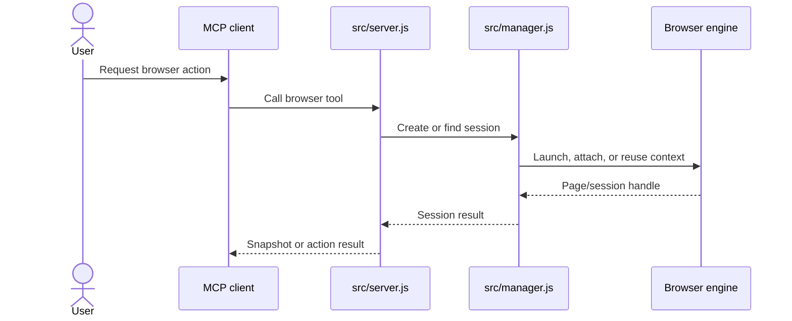

# Architecture

`browser-mcp` exposes local browser automation as MCP tools. The process can run over stdio for a
single client or HTTP for a daemon-style multi-client setup.

## Components

## Session Sequence

## Engine Boundaries

| Engine | Backend | Notes |
|---|---|---|
| `chrome` | Playwright Chrome channel | Real Chrome binary. |
| `chromium` | Playwright bundled Chromium | Good for headless and CI. |
| `webkit` | Playwright WebKit | Safari engine coverage. |
| `safari` | Apple `safaridriver` | Single-session OS limit. |
| attach | Chrome DevTools Protocol | Uses an already-running Chrome profile. |

## Safety Rules

- Attached Chrome sessions detach; they do not close the user's browser.
- Safari.app is single-session because that is an Apple WebDriver limit.
- Screenshots go to `APEX_BROWSER_SHOTS`, defaulting to a temporary path.
- The daemon stays local unless the host/port are changed by the operator.
